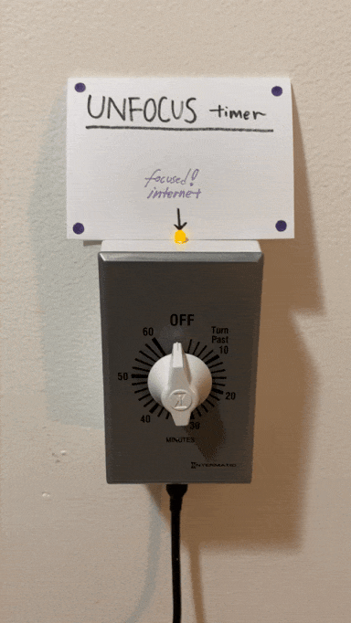

# Unfocus Timer
A physical timer switch to momentarily allow the unfocused internet.

Turn the countdown timer on. The focused internet LED turns off, and the unfocused internet floods in. 

The mechanical timer counts down:

_30 minutes._

_15 minutes._

_5 minutes._

When the timer finishes, the LED turns back on, and the focused internet is present again.

## Intention

`thumb  -------> legs`

`screen -------> space`

An experiment in physicalizing the affordances of the Internet. 

By making the timer a physical object in my kitchen, far away from my computing devices, habits of distraction that I might have on my computer, or phone, become transformed into physical (and thus spatial) actions. 

Instead of swiping to a URL with my **_thumb_**, I have to get up, use my **_legs_**, in order to turn the timer's knob.

The unit of distraction and unfocus is not in the action of the finger, but of the leg/bodily movement. 

The immediate twitch of the thumb is transformed into a larger, full-body kinaesthetic action. 

By elongating the action, impulse is transformed into intent.

In other words: You can't _twitch_ your way into distraction; by a distraction necessitating a walk across the room, the room affords more _intent_ in being online.

## Details

This works at a network / DNS level; the unfocus timer allows/blocks traffic to 'distracting' sites. Phones, computers, alike are all affected.

## Ingredients

Created with:
[Pi-hole](https://pi-hole.net/) + [Home Assistant](https://www.home-assistant.io/) + [ESPHome](https://esphome.io/) + an ESP32.

